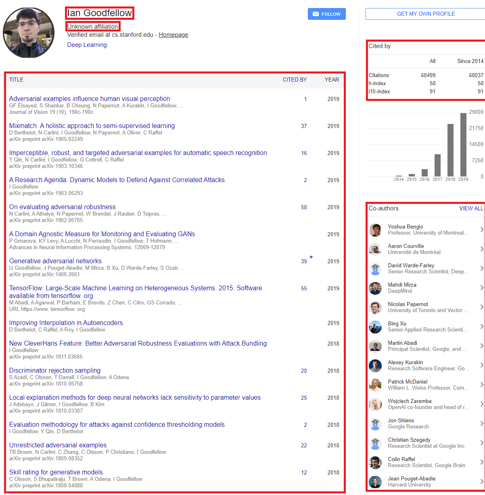
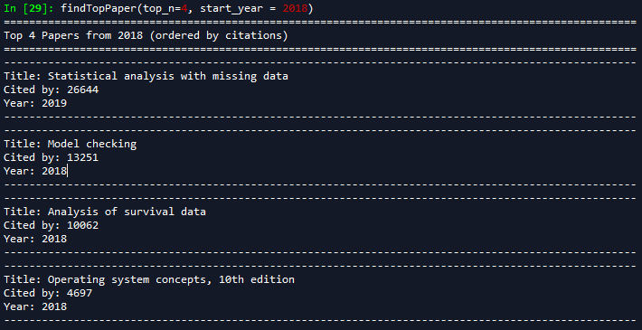
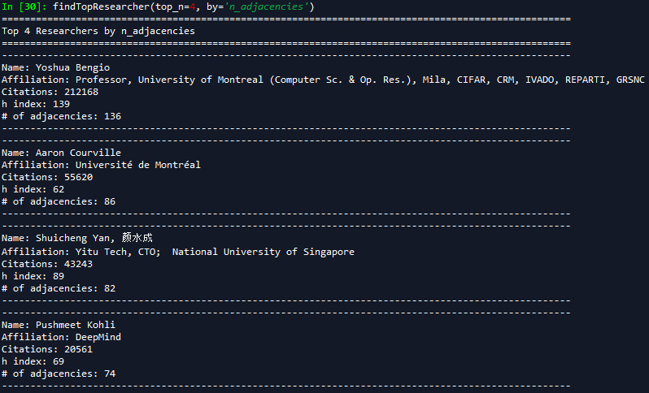
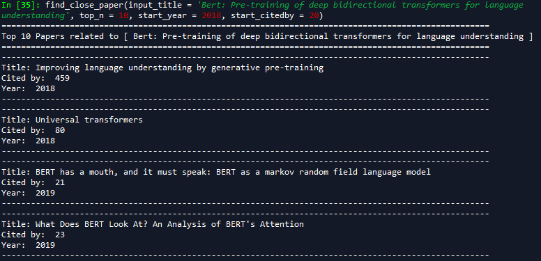
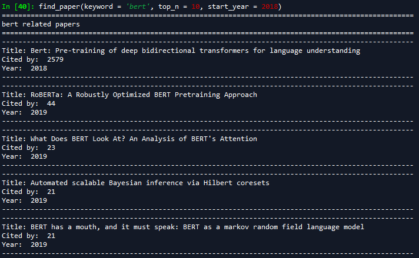

# Researcher Network by Google Scholar
## Co-authors of google scholar are used to identify the connections among researchers.
## 목표: Ian Goodfellow를 기준으로 연구자 간의 네트워크를 구축해보자!

##
# 크롤링 과정

### 1. 최초의 연구자(Ian Goodfellow)의 google scholar에 들어감.
### 2. 1번의 연구자의 정보(affiliation, paper, citations, h index)를 추출 및 DB에 저장
### 3. 1번의 공동 저자(Co author)들의 정보(name, URL, affiliation)를 추출 및 DB에 저장
### 4. 3번의 공동 저자들의 URL에 들어가서 2번과 3번을 동일하게 시행 
##
## [DB]
### MySQL을 통해 정보 저장
### 1. Researcher

###
### 2. Paper

##
## [기본 정보]
### 전체 연구자(researcher) 수: 52943
### 전체 논문(Paper) 수: 170176
##
## [함수 설명]
### 1. findTopPaper(top_n, start_year): stary_year부터 지금까지의 paper를 citedby를 기준으로 top_n개 만큼 추출.

### 2. findTopResearcher(top_n, by): by를 기준으로 top_n명의 researcher 추출.

### 3. find_close_paper(input_title, top_n, start_year, start_citedby): title 간의 cosine similarity를 사용하여 유사한 title 추출. (start_year과 start_citedby 이상인 paper 중) input_title과 유사한 title을 가진 paper를 top_n만큼 추출. (이미 존재하고 있는 paper만 입력 가능)

### 4. find_paper(keyword, top_n, start_year): title에 keyword가 들어간 paper를 citedby를 기준으로 top_n개 추출.

##
## [파일 설명]
### 1. ../code/first.mwb: googlescholar database 생성
### 2. ../code/googlescholar.sql: 크롤링을 통해 생성된 DB
### 3. ../code/GoogleScholar_utitlities.py: 위에서 설명한 크롤링 및 DB 저장, 정보 추출에 필요한 함수 구현
### 4. ../code/GoogleScholar_word2vec.py: Word2Vec을 이용해서 find_close_paper 함수 구현

