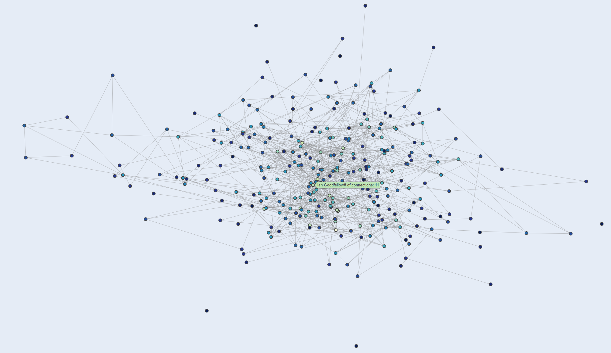
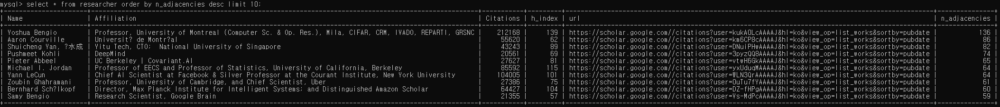
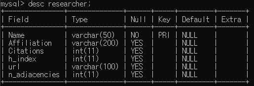
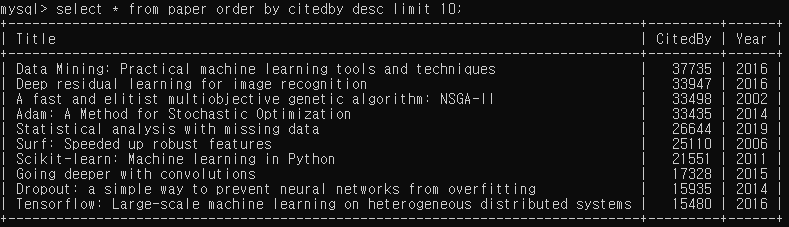
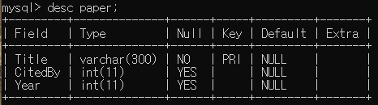

# Researcher Network by Google Scholar
## Co-authors of google scholar are used to identify the connections among researchers.
## 목표: Ian Goodfellow를 기준으로 연구자 간의 네트워크를 구축해보자!

##
## [크롤링 과정]
### 1. 최초의 연구자(Ian Goodfellow)의 google scholar에 들어감.
### 2. 1번의 연구자의 정보(affiliation, paper, citations, h index)를 추출 및 DB에 저장
### 3. 1번의 공동 저자(Co author)들의 정보(name, URL, affiliation)를 추출 및 DB에 저장
### 4. 3번의 공동 저자들의 URL에 들어가서 2번과 3번을 동일하게 시행 
##
## [기본 정보]
### 전체 연구자(researcher) 수: 52943
### 전체 논문(Paper) 수: 170176
##
## [DB]
### MySQL을 통해 정보 저장
### 1. Researcher

###
### 2. Paper

